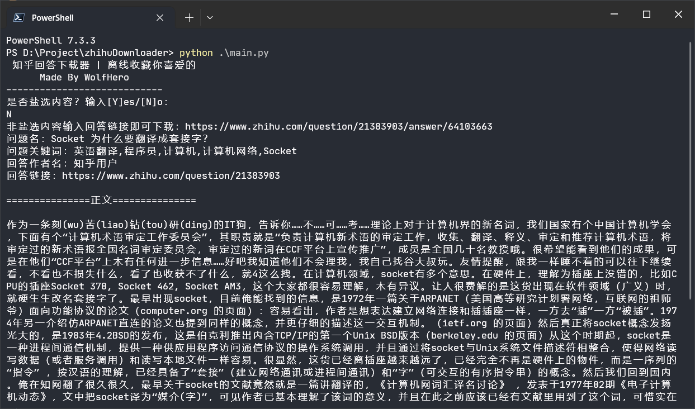

## 知乎回答下载器
#### 离线收藏你喜爱的

一个自己花了四小时写的略显简陋的知乎回答下载器，利用requests库和BeautifulSoup库实现输入知乎回答链接即可下载回答内容和问题概要。

如果是盐选会员专属内容的话，只能下载免费试读部分，或者让有会员的朋友登录知乎去把回答所在网页直接Ctrl+S保存下来，然后加载到此脚本中。



具体怎么使用直接运行 `main.py` 就知道了，我写的指引还是比较详细的。

对了，不能保存图片，不过 `Ctrl+S`会下载网页的大部分素材，也包括清晰度较低的图片。

#### 需要安装的第三方库
```shell
pip install bs4 -i https://pypi.douban.com/simple --trusted-host pypi.douban.com
pip install lxml -i https://pypi.douban.com/simple --trusted-host pypi.douban.com
```

#### 运行
```shell
python main.py
```

### 关注我
我的知乎ID：WolfHero

哔哩哔哩ID：沃尔夫WolfHero

随缘更新

### 开源许可
本项目（算得上项目吗）采用BSD协议开源